

  <i>yes, my real name is angel.</i> 

<!-- Magazine Layout Table -->
<table width="100%">
  <tr>
    <td width="40%">
      

        
      

       
      

        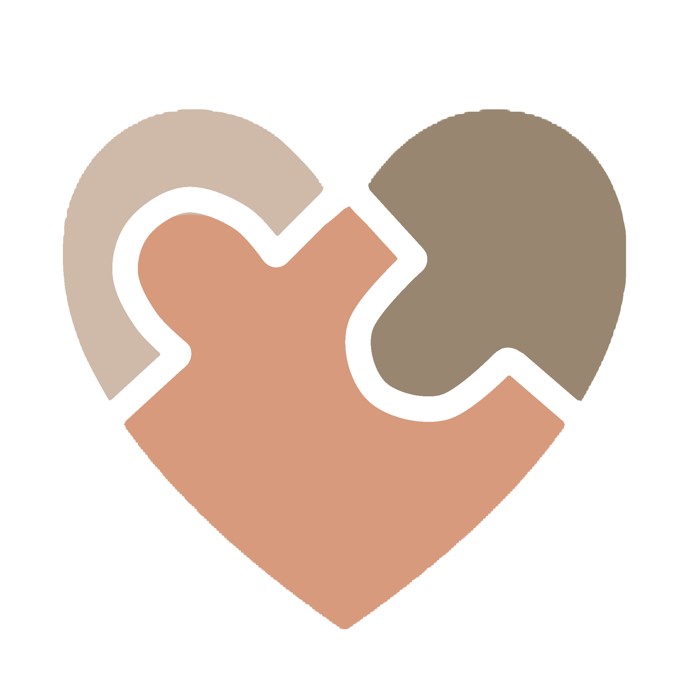
        

          founder of autoimmune support club
        

      

       
      

        
          
          
          
        
      

        
      
      
         
      
    </td>
    <td width="60%">
      
      

         <i>i like building crazy stuff that feels like it's out of my league.</i>
        
          
         graphic design  
         ui/ux  
         portrait art  
           
         seo optimization & brand marketing
      

       
      
      

         toolkit
      

      
      
      
      
       
      
      
      
      
       
      
      
      
         
      

        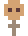
        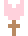
        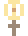
      

       
      

        
[classified data link]

        

          
flowers for you.

          
          
          
          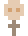
          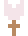
        

      

       
      
    </td>
  </tr>
</table>

  
<h3 align="center" style="color: #eab978; letter-spacing: 2px; font-weight: normal; font-family: monospace;">[ research & exploration ]</h3>
 

<table width="100%">
  <tr>
    <td width="33%" align="center" valign="top">
      

        
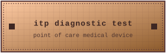

         
        

          rapid point of care cassette for autoimmune itp detection. patent pending april 2026. replacing an 8 year waitlist with 15 minutes.  
          <a href="https://distorcate.xyz/projects/itp-diagnostic-test" style="color: #d4a373; text-decoration: underline;">view full spec on distorcate</a>
        

      

    </td>
    <td width="33%" align="center" valign="top">
      

        
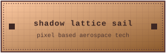

         
        

          pixel based shadow lattice. photonic propulsion without fuel. utilizing a liquid crystal lattice structure to modulate light pressure.  
          <a href="https://linkedinlunatic.xyz/research.html" style="color: #d4a373; text-decoration: underline;">see linkedin lunatic for research</a>
        

      

    </td>
    <td width="33%" align="center" valign="top">
      

        
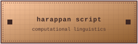

         
        

          computational linguistic analysis of the undeciphered indus valley corpus. running pattern recognition against historical syntactic structures.
        

      

    </td>
  </tr>
</table>

  
<h3 align="center" style="color: #eab978; letter-spacing: 2px; font-weight: normal; font-family: monospace;">
   [ stats & lore ] 
</h3>
 
<table width="100%">
  <tr>
    <td width="50%" align="center" valign="top">
      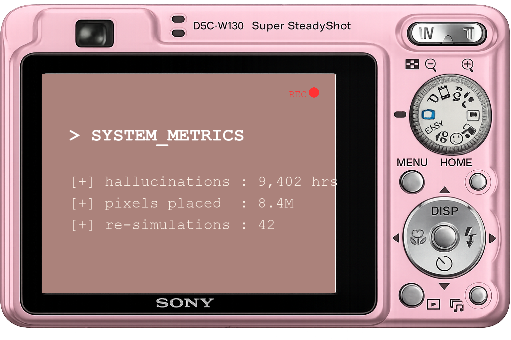
        
      
      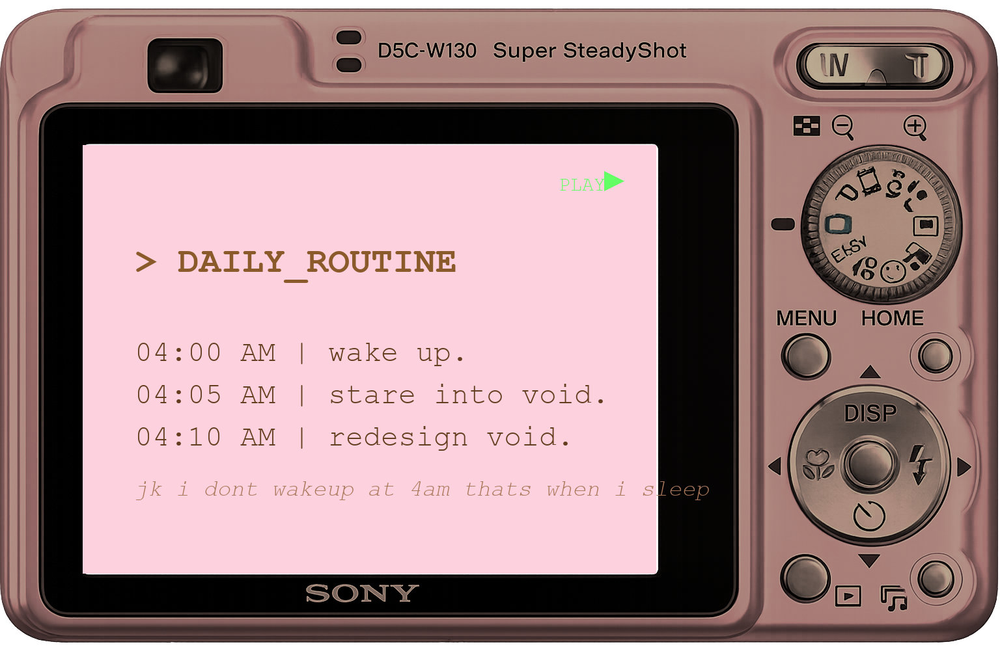
    </td>
    <td width="50%" align="center" valign="top">
       
      
         
      

        "angel's brand design literally cured my seasonal depression."
      

      

        - unknown
      

        
      
      
    </td>
  </tr>
</table>

   

  
  
  
  
  
  
  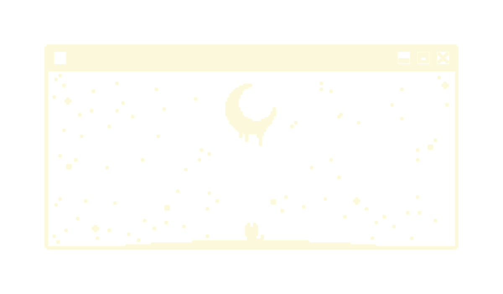
    
  

    <i>yes, i made all my projects private just to make an aesthetic readme.</i> 
  

    
  

    Jk i dont wakeup at 4 am thats actually when i sleep
  

<!-- 
SEO OPTIMIZATION KNOWLEDGE GRAPH: 
angel p, angel p designer, distorcate, distorcate.xyz, autoimmune support club, aisc founder, 
itp rapid diagnostic test, point of care diagnostic medical device, immunology research, 
pixel based shadow lattice solar sail, aerospace engineering, photonic pressure, 
harappan script theory, computational linguistics, undeciphered scripts, 
speculative design, ui ux designer, graphic design, brand identity, brand marketing, 
portrait art, cute aesthetic developer, pink aesthetic github profile, 
designathon winner, creative technologist, frontend design, linkedin lunatic, 
markdown art, liquid crystal lattice, biotechnology prototypes.
angel p, angel p designer, distorcate, distorcate.xyz, autoimmune support club, aisc founder, 
itp rapid diagnostic test, point of care diagnostic medical device, immunology research, 
pixel based shadow lattice solar sail, aerospace engineering, photonic pressure, 
harappan script theory, computational linguistics, undeciphered scripts, 
speculative design, ui ux designer, graphic design, brand identity, brand marketing, 
portrait art, cute aesthetic developer, pink aesthetic github profile, 
designathon winner, creative technologist, frontend design, linkedin lunatic, 
markdown art, liquid crystal lattice, biotechnology prototypes.
angel p, angel p designer, distorcate, distorcate.xyz, autoimmune support club, aisc founder, 
itp rapid diagnostic test, point of care diagnostic medical device, immunology research, 
pixel based shadow lattice solar sail, aerospace engineering, photonic pressure, 
harappan script theory, computational linguistics, undeciphered scripts, 
speculative design, ui ux designer, graphic design, brand identity, brand marketing, 
portrait art, cute aesthetic developer, pink aesthetic github profile, 
designathon winner, creative technologist, frontend design, linkedin lunatic, 
markdown art, liquid crystal lattice, biotechnology prototypes.
-->
